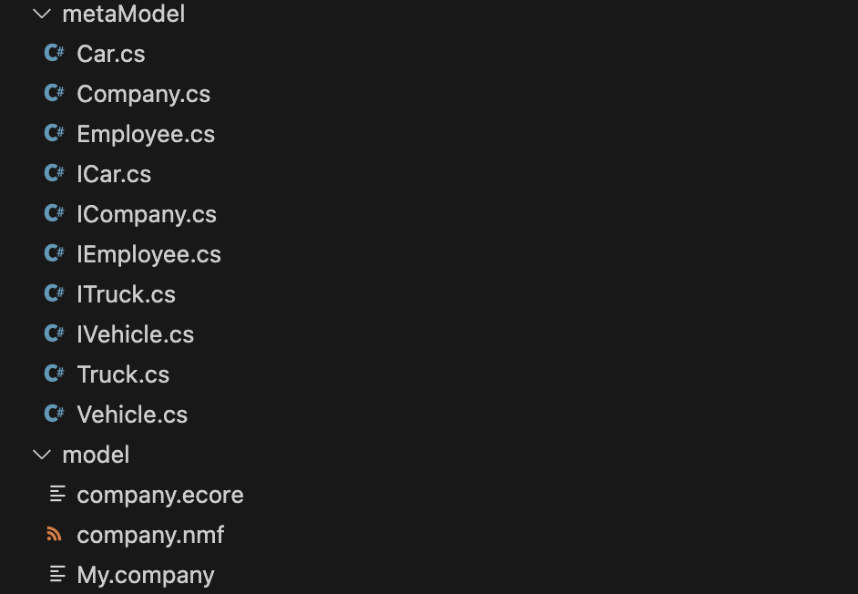

# Starting our first project

The example we are using here is a simple and very abstract model of a company. First, let's take a look at the corresponding UML Diagram:


From this class diagram, we use the EMF Editor to create the corresponding Ecore file and the appropriate XMI files, which we then copy into a model directory in our NMF project.


Now we change to our model directory in the terminal and execute our Ecore2Code command there to generate the corresponding classes for our project. 
As for the command itself, it copies the ecore file and creates a new file with the extension .nmf (which we define ourselves) and adapts this file so that it works for NMF. Next, the command generates the corresponding C# classes from it.
```bash
Ecore2Code -f -n NMFDemo -o metaModel -m company.nmf company.ecore 
```
<aside class="note">

**Note:**

For a more detailed explanation, you can take a closer look at the individual abbreviations in the Model generation chapter. 

</aside>

After executing the command, we take a look at what has been added.

As we can see, a directory has been created with the corresponding generated classes. These classes are the entities from the UML diagram.

<aside class="note">

**Note:**

The My.company file is an XMI file generated using the EMF Editor, it only describes one possible use case from the class diagram, for example: A company with three employees and two cars. It is merely a description of a possible use case that may occur

</aside>

Next, we need to define our generated company.nmf file as an EmbeddedResource in the .csproj file, which must look like this:
```xml
<Project Sdk="Microsoft.NET.Sdk">

    <PropertyGroup>
        <OutputType>Exe</OutputType>
        <TargetFramework>net6.0</TargetFramework>
        <ImplicitUsings>enable</ImplicitUsings>
        <Nullable>enable</Nullable>
    </PropertyGroup>

    <ItemGroup>
      <PackageReference Include="NMF-Basics" Version="2.0.193" />
    </ItemGroup>

    <ItemGroup>
      <EmbeddedResource Include="company.nmf"/>
    </ItemGroup>

</Project>
```

To be able to access different models of our UML Diagram Company, we need to register the company.nmf, for this we first create a directory modelRegistry with a file ModelRegistry.cs, the file must have the following content (`modelRegistry/ModelRegistry.cs`):
```csharp
using NMF;

[assembly: NMF.Models.ModelMetadata("http://www.example.org/company", "company.nmf")]
```

Once these steps have been completed, we can load our passed example (My.company) into the code (`Program.cs`):
```csharp
using NMF.Models.Repository;
using NMFDemo.Company;

class Program
{
    static void Main(string[] args)
    {
        var repository = new ModelRepository();
        var myCompanyPath = Path.Combine("model", "My.company");
        var model = repository.Resolve(myCompanyPath);
        var company = model.RootElements[0] as Company;

        Console.WriteLine("Load successfull!");
    }
}
```

The first thing we do is load our ModelRepository (which allows us to load our passed Use Cases or XMI files into the code), after which we obtain the model by specifying the path of the XMI file. Now we have the opportunity to access individual nodes in this tree structure of the XMI file and assign a type to them from the classes previously generated.

