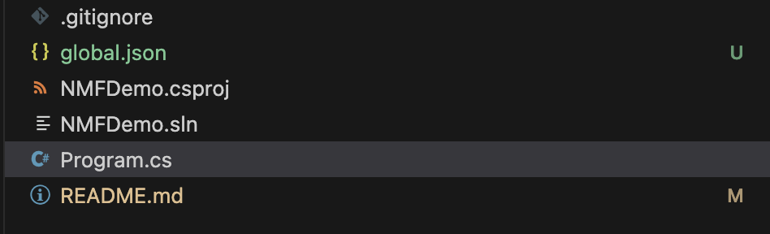
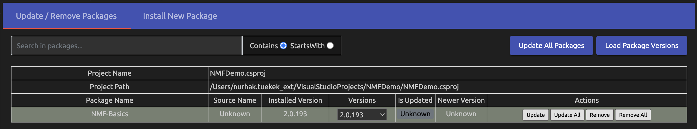

# NMF Setup

## SDK Setup
Before we download the NMF-Basics package, our application first needs the correct .Net SDK version. This would be all .Net SDK 6 versions. To check if you have the right versions installed enter the command: 

> ```bash
> dotnet --list-sdks
> ```
> 
> The command should show you the following output:
> 
> ```plaintext
> 6.0.100 [/usr/local/share/dotnet/sdk]
> ```


To ensure that your application uses the correct .NET SDK version, create a `global.json` file in the root directory of your project. Open a text editor and add the following content to the `global.json` file:

```json
{
  "sdk": {
    "version": "6.0.100"
  }
}
```

An example of the folder structure would be: In the directory
`'/Users/hsrm/VisualStudioProjects/NMFDemo'` is where we want our application to run, then we also save our `global.json` file in this directory.


## installing the right packages via nuget
Next, we create the application. For initialization, we create a simple ConsoleApplication with a simple main method: 
`'/Users/hsrm/VisualStudioProjects/NMFDemo/Program.cs'`


Then we load the corresponding package via nuget Package Manager, `NMF-Basics`. 
<aside class="note">

**Note:**

If you are working with a Mac, you have to download the Nuget Package Manager separately as a plugin
 via the Visulastudio Marketplace.

</aside>



The project .csproj file should then have the following package reference:
```xml
<Project Sdk="Microsoft.NET.Sdk">

    <PropertyGroup>
        <OutputType>Exe</OutputType>
        <TargetFramework>net6.0</TargetFramework>
        <ImplicitUsings>enable</ImplicitUsings>
        <Nullable>enable</Nullable>
    </PropertyGroup>

    <ItemGroup>
      <PackageReference Include="NMF-Basics" Version="2.0.193" />
    </ItemGroup>

</Project>
```

For all those who do not have a PackageManager Console (Mac users), you must download the Ecore2Code command separately for model generation:
```bash
dotnet tool install --global NMF-Ecore2Code --version 2.0.193
```
