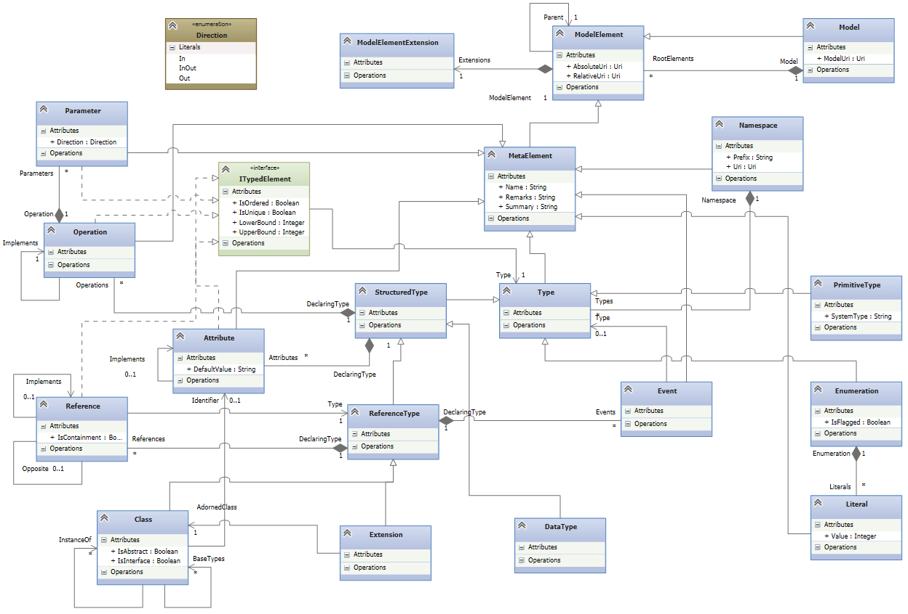

# NMeta
NMeta is the meta-metamodel used in NMF. It is inspired by Ecore, the meta-metamodel used in [EMF](http://www.eclipse.org/modeling/emf/), but modified and extended in multiple ways to overcome Ecores limitations as well as to support platform specifics of the .NET platform (such as supports for structures and events). 

An (almost) complete diagram of NMeta is shown above. For users of other meta-metamodels like Ecore, most of the above is well known, such as the concept of classes, namespaces (which is the packaging scheme) and types. However, there are a couple of noteworthy differences.

The most distinguishing features of NMeta are:
* Builtin addressing scheme (every model element has an absolute and a relative Uri)
* Metamodel extensions through the _Extension_ metaclass and the reference to model element extensions
* Explicit modeling of events
* Deep modeling (classes can instantiate other classes)

To get more details, the following wiki pages contain more details:
* [ModelElement](ModelElement)
* [MetaElement](MetaElement)

More documentation, including especially how metamodels are generated to code will be coming soon.