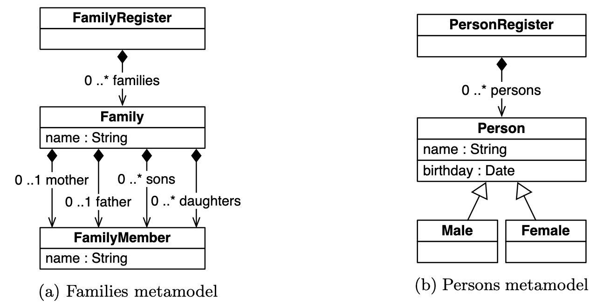
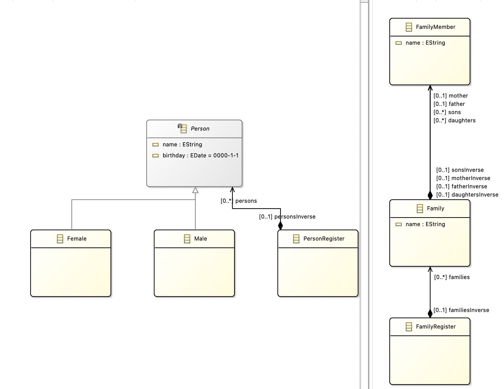

# Family 2 Person

## Introduction to biderictional transformations
Bidirectional transformations (bx) are transformations that can be executed both from the source to the target and vice versa. This means that not only is one data structure transformed into another, but there is also the capability to restore the original structure through the reverse transformation. Bidirectional transformations are crucial in various applications, especially when data needs to be exchanged between different representations or models. Examples of scenarios where bidirectional transformations are relevant include bidirectional data converters, round-trip engineering in software development, or view updates in databases. The use of bidirectional transformations enables consistent and complete synchronization between different data representations.

`Example`: Imagine you have an online calendar on your computer and another one on your smartphone. Bidirectional transformation allows appointments and events to seamlessly transfer between your computer and smartphone, ensuring both calendars stay updated.

For example, when you add an appointment on your computer, it automatically syncs to your smartphone. Likewise, if you edit an appointment on your smartphone, the change is mirrored on your computer. Bidirectional transformation ensures synchronization in both directions, keeping your schedule consistent and current across both devices.

## Use Case


The models assume a unique root in each model, where a family register stores families, and a person register maintains a flat collection of individuals. The metamodel specifies roles, allowing for at most one father and one mother, along with an arbitrary number of daughters and sons. The models lack key property assumptions, permitting multiple families with the same name, clashes within a family, and multiple persons with the same name and birthday. All collections are assumed to be unordered.

Consistency between the families and persons models is defined by a bijective mapping, ensuring mothers/daughters and fathers/sons are paired with females/males. After a transformation, this consistency must be maintained. For batch transformations, a forward transformation maps family members to persons based on gender, while the backward transformation introduces configurability through boolean parameters, controlling mappings to parents or children and preference for existing families or new ones.

In incremental transformations, various updates are considered. Forward updates involve the insertion, deletion, renaming, or moving of families and members. Backward updates, affected by dynamic configuration parameters, include deletion, insertion, and changes in name, but not birthdays. These transformations exemplify a round-trip engineering scenario, requiring bidirectional updates.
[Click here to see the complete TTC solution](https://sdq.kastel.kit.edu/publications/pdfs/hinkel2017f.pdf)

## Tutorial


We generate the corresponding Ecore files from the two class diagrams shown above. One for the family model and one for the person model. 
We then generate the NMF models and classes, configure our .csproj file and load our models into the Program.cs file analogous to 
[Starting our first project](../models/FirstNmfProject.md)

We have to add a file named `Families2PersonsSynchronization.cs` that looks like this:
```csharp
class Families2PersonsSynchronization : ReflectiveSynchronization
    {
        public class FamilyRegisterToPersonRegister : SynchronizationRule<FamilyRegister, PersonRegister>
        {
            // Synchronization Block
            public override void DeclareSynchronization()
            {
                SynchronizeMany(SyncRule<MemberToMember>(),
                    fam => new FamilyMemberCollection(fam),
                    persons => persons.Persons);
            }
        }

        public class MemberToMember : SynchronizationRule<IFamilyMember, IPerson>
        {
            public override void DeclareSynchronization()
            {
                Synchronize(m => m.GetFullName(), p => p.Name);
            }
        }

        public class MemberToMale : SynchronizationRule<IFamilyMember, IMale>
        {
            public override void DeclareSynchronization()
            {
                MarkInstantiatingFor(SyncRule<MemberToMember>(), leftPredicate: m => m.FatherInverse != null || m.SonsInverse != null);
            }

            protected override IFamilyMember CreateLeftOutput(IMale input, IEnumerable<IFamilyMember> candidates, ISynchronizationContext context, out bool existing)
            {
                var member = base.CreateLeftOutput(input, candidates, context, out existing);
                member.Extensions.Add(new TemporaryStereotype(member)
                {
                    IsMale = true,
                    LastName = input.Name.Substring(0, input.Name.IndexOf(','))
                });
                return member;
            }
        }

        public class MemberToFemale : SynchronizationRule<IFamilyMember, IFemale>
        {
            public override void DeclareSynchronization()
            {
                MarkInstantiatingFor(SyncRule<MemberToMember>(), leftPredicate: m => m.MotherInverse != null || m.DaughtersInverse != null);
            }

            protected override IFamilyMember CreateLeftOutput(IFemale input, IEnumerable<IFamilyMember> candidates, ISynchronizationContext context, out bool existing)
            {
                var member = base.CreateLeftOutput(input, candidates, context, out existing);
                member.Extensions.Add(new TemporaryStereotype(member)
                {
                    IsMale = false,
                    LastName = input.Name.Substring(0, input.Name.IndexOf(','))
                });
                return member;
            }

            // should this two model elements be linked, if so define a rule for shared attributes like name, ...
            public override bool ShouldCorrespond(IFamilyMember left, IFemale right, ISynchronizationContext context)
            {
                if (left.Name == right.Name) {
                    return true;
                } 
                return false;
            }
        }

        private class FamilyMemberCollection : CustomCollection<IFamilyMember>
        {
            public FamilyRegister Register { get; private set; }

            public FamilyMemberCollection(FamilyRegister register)
                : base(register.Families.SelectMany(fam => fam.Children.OfType<IFamilyMember>()))
            {
                Register = register;
            }

            public override void Add(IFamilyMember item)
            {
                var temp = item.GetExtension<TemporaryStereotype>();
                item.AddToFamily(Register, temp.IsMale, temp.LastName);
                item.Extensions.Remove(temp);
            }

            public override void Clear()
            {
                Register.Families.Clear();
            }

            public override bool Remove(IFamilyMember item)
            {
                item.Delete();
                return true;
            }
        }
    }

    public class TemporaryStereotype : ModelElementExtension
    {
        public bool IsMale { get; set; }

        public string LastName { get; set; }

        public TemporaryStereotype(IFamilyMember parent)
        {
            parent.Extensions.Add(this);
        }

        public override IExtension GetExtension() { return null; }
    }

    public static class Helpers
    {
        public static bool PreferCreatingParentToChild = true;
        public static bool PreferExistingFamilyToNew = true;

        private static ObservingFunc<IFamilyMember, string> fullName = new ObservingFunc<IFamilyMember, string>(
            m => m.Name == null ? null : ((IFamily)m.Parent).Name + ", " + m.Name);
        
        [LensPut(typeof(Helpers), "SetFullName")]
        [ObservableProxy(typeof(Helpers), "GetFullNameInc")]
        public static string GetFullName(this IFamilyMember member)
        {
            return fullName.Evaluate(member);
        }

        public static INotifyValue<string> GetFullNameInc(this IFamilyMember member)
        {
            return fullName.Observe(member);
        }

        public static void AddToFamily(this IFamilyMember item, IFamilyRegister register, bool isMale, string name)
        {
            IFamily family = null;
            if (PreferExistingFamilyToNew)
            {
                IEnumerable<IFamily> candidateFamilies = register.Families.AsEnumerable().Where(fam => fam.Name == name);
                if (PreferCreatingParentToChild)
                {
                    if (isMale)
                    {
                        family = candidateFamilies.Where(fam => fam.Father == null).FirstOrDefault();
                    }
                    else
                    {
                        family = candidateFamilies.Where(fam => fam.Mother == null).FirstOrDefault();
                    }
                }
                family = family ?? candidateFamilies.FirstOrDefault();
            }
            if (family == null)
            {
                family = new Family { Name = name };
                register.Families.Add(family);
            }
            if (isMale)
            {
                if (family.Father == null && PreferCreatingParentToChild)
                {
                    family.Father = item;
                }
                else
                {
                    family.Sons.Add(item);
                }
            }
            else
            {
                if (family.Mother == null && PreferCreatingParentToChild)
                {
                    family.Mother = item;
                }
                else
                {
                    family.Daughters.Add(item);
                }
            }
        }

        public static void SetFullName(this IFamilyMember member, string newName)
        {
            var family = member.Parent as IFamily;
            var separator = newName.IndexOf(", ");
            var lastName = newName.Substring(0, separator);
            var firstName = newName.Substring(separator + 2);
            member.Name = firstName;
            if (family != null && family.Name != lastName)
            {
                var isMale = member.FatherInverse != null || member.SonsInverse != null;
                member.AddToFamily(family.FamiliesInverse, isMale, lastName);
            }
        }
    }
```
This file defines our Synchronization logic between the 2 models. A further explanation will follow with some examples in the next part of the tutorial. 

We modify the Program.cs as follows:
```csharp
class Program
    {
        private FamilyRegister familyRegister;
        private PersonRegister personRegister;

        private ModelRepository repository = new ModelRepository();

        private Families2PersonsSynchronization synchronization = new Families2PersonsSynchronization();

        public Program()
        {
            var familyRootModel = new Model();
            var personRootModel = new Model();

            familyRegister = new FamilyRegister();
            personRegister = new PersonRegister();

            synchronization.Synchronize(
                synchronization.SynchronizationRule<Families2PersonsSynchronization.FamilyRegisterToPersonRegister>(),
                ref familyRegister, // Familyregister is the left model
                ref personRegister, // Personregister is the right model
                SynchronizationDirection.LeftWins, // prioritizes the left synchronization of left model (without shouldCorrespond it has no impact)
                ChangePropagationMode.TwoWay); // TwoWay means Bidirectional synchronization 

            familyRootModel.RootElements.Add(familyRegister);
            personRootModel.RootElements.Add(personRegister);

            repository.Models.Add(new Uri("ttc:source"), familyRootModel);
            repository.Models.Add(new Uri("ttc:target"), personRootModel);
        }

        static void Main(string[] args)
        {
        }
    }
```
A short explanation to the code. 
1. Attributes
- `familyRegister` and `personRegister` are private class members representing instances of classes, used for managing family and person
registrations.
- `repository` is an instance of the [ModelRepository](../models/api/NMF.Models.Repository.ModelRepository.yml) class, responsible for managing models.
- `synchronization` is an instance of the `Families2PersonsSynchronization` class, designed for synchronizing data between family and person registers.

2. Constructor
- Two instances of the Model class (`familyRootModel` and `personRootModel`) are created. These will serve as root models for family and person registers.
- Instances of classes (`FamilyRegister` and `PersonRegister`) are created and assigned to `familyRegister` and `personRegister`.
- ## Synchonization:
    -   The [Synchronize](../synchronizations/api/NMF.Synchronizations.Synchronization.yml) method is called on the `synchronization` instance.
    -   It uses the synchronization rule `Families2PersonsSynchronization.FamilyRegisterToPersonRegister`.
    -   `ref familyRegister` represents the left model, and `ref personRegister` represents the right model.
    -   `SynchronizationDirection.LeftWins` [Synchronization Api](../synchronizations/api/NMF.Synchronizations.SynchronizationDirection.yml) is used, prioritizing changes from the left model (familyRegister) in case of conflicts. (without shouldCorrespond it has no impact)
    -   `ChangePropagationMode.TwoWay` [Transformation Api](../transformations/api/NMF.Transformations.ChangePropagationMode.yml) indicates bidirectional (two-way) synchronization, allowing changes in both directions.
    - `FamilyRegisterToPersonRegister` Class:
        ```csharp
        public class FamilyRegisterToPersonRegister : SynchronizationRule<FamilyRegister, PersonRegister>
        {
            // Synchronization Block
            public override void DeclareSynchronization()
            {
                SynchronizeMany(SyncRule<MemberToMember>(),
                    fam => new FamilyMemberCollection(fam),
                    persons => persons.Persons);
            }
        }
        ```
    -   This class extends `SynchronizationRule<FamilyRegister, PersonRegister>` [Synchronization Rules](../synchronizations/api/NMF.Synchronizations.SynchronizationRule-2.yml) and is designed for synchronizing instances of `FamilyRegister` to `PersonRegister`. 
    -   The `DeclareSynchronization` method is overridden, and it declares synchronization instructions using `SynchronizeMany` [Synchronization Rules](../synchronizations/api/NMF.Synchronizations.SynchronizationRule-2.yml)
    - `MemberToMember` Class:
        ```csharp
        public class MemberToMember : SynchronizationRule<IFamilyMember, IPerson>
        {
            public override void DeclareSynchronization()
            {
                Synchronize(m => m.GetFullName(), p => p.Name);
            }
        }
        ```
    -   This class extends `SynchronizationRule<IFamilyMember, IPerson>` [Synchronization Rules](../synchronizations/api/NMF.Synchronizations.SynchronizationRule-2.yml) and is designed for synchronizing instances of types implementing `IFamilyMember` to `IPerson`
    -   The `DeclareSynchronization` method is overridden, and it declares `synchronization` instructions using `Synchronize`.
    -   It synchronizes the result of calling `m.GetFullName()` on the left side to `p.Name` on the right side.
    ```csharp
    public static string GetFullName(this IFamilyMember member)
            {
                return fullName.Evaluate(member);
            }
    ```
    -   This method returns the full name of a family member.
    -   It accesses the static variable fullName, which is a function of the type `ObservingFunc<IFamilyMember, string>` [Expression](../expressions/api/NMF.Expressions.ObservingFunc-10.yml).
    -   The fullName function is used to create the full name of the member. The name is composed of the member's name and the name of their family, separated by a comma.
    -   If the member's name is null, null is returned.
    -   The `GetFullName()` method is defined as an extension method for objects of type IFamilyMember.
    -   The Evaluate function returns an observable value that keeps track of any changes
    -   Summary: In summary, the synchronization process involves calling the Synchronize method on the synchronization instance, using specific synchronization rules (FamilyRegisterToPersonRegister and MemberToMember) to synchronize data between instances of FamilyRegister, PersonRegister, IFamilyMember, and IPerson. The synchronization is bidirectional and prioritizes changes from the left model (familyRegister).
- The rest of the constructor is equivalent to the FirstNmfProject initialization. Adding the registry classes as RootElements and Adding the empty Models.


To get a better understanding of synchronization, let's illustrate the whole thing with an example. The example looks like this:
```csharp
static void Main(string[] args)
        {
            // 1. First case Bidirectional synchronization.
            var program = new Program();
            program.familyRegister.Families.Add(new Family {
                Father = new FamilyMember {
                    Name = "Marx"
                }, 
                Name = "Mustermann"
            });

            var fatherFirstName = program.familyRegister.Families.First().Father;
            var familyName = program.familyRegister.Families.First().Name;
            
            var person = program.personRegister.Persons.First().Name;

            Console.WriteLine(fatherFirstName); // FamilyMember 'Marx'
            Console.WriteLine(familyName); // Mustermann
            Console.WriteLine(person); // Mustermann, Marx
        }
```
But how does this happen? The answer is:  
When `FamilyRegisterToPersonRegister` is invoked, it synchronizes the members of each family to persons.
Since you're using `SynchronizeMany` [Synchronization Rules](../synchronizations/api/NMF.Synchronizations.SynchronizationRule-2.yml), it synchronizes each member of the family to a person.
Each `FamilyMember` in `FamilyRegister` is synchronized with an `IPerson` in `PersonRegister` based on their full names.
So, when you add a Family to familyRegister, each FamilyMember within that family gets synchronized and added to personRegister as a Person with the corresponding name.

The same works the other way around:
```csharp
            // 2. synchronization from person to family.
            program.personRegister.Persons.Add(new Male{
                Name = "Smith, John"
            });

            var smith = program.familyRegister.Families.Reverse().First().Name;
            var john = program.familyRegister.Families.Reverse().First().Father;
            Console.WriteLine(smith); // Smith
            Console.WriteLine(john); // FamilyMember 'John'
```
We can see from the definition of the synchronization rule that the newly added person also gets registered as a new family with the name Smith and their members.

