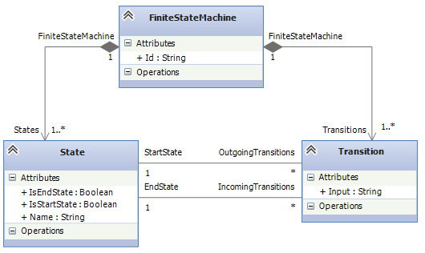
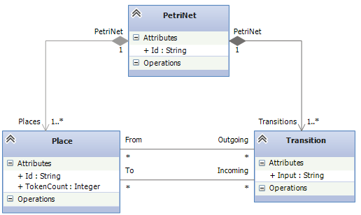

# Finite State Machines to Petri Nets
Finite state machines and Petri Nets are both well known formalisms to specify behavior and are widely used across industry and academia, e.g. to model business processes. 

Finite state machines consist of states and transitions. States can be start states or end states. Transitions can have exactly one starting state and exactly one target state. However, states can have multiple incoming or outgoing transitions. Transitions are usually triggered by an input that we catch up as simple strings here.

Petri Nets are very similar to finite state machines, yet a little different. The equivalent of states in Petri Nets are states. The main difference is that transitions can have arbitrarily many source or target places. Furthermore, instead of being a start state, a place has a variable amount of tokens. Petri Nets represent their status not by a single state, but by the distribution of tokens among places. If a transition "fires", it takes away a token from each source place and adds a token to each target place. The property of being an end state is also missing. Instead, Petri Nets "end" if a transition swallows the last token, i.e. a transition consumes the token but has no target place to create a new token to.

Finite state machines are a very basic form of behavioral formalisms and have many restrictions. Most relevant for business process modeling for example, the system can always only be in a single state, which is infeasible for modeling parallel actions. Here, Petri Nets can serve this need as they can hold tokens on multiple places.

Thus, the transformation of finite state machines to Petri Nets is an interesting case study an serves as an example to demonstrate [NMF Transformations](../transformations/index.md) and [NMF Synchronizations](index.md). 

The transformation now transforms each state to a corresponding place. If the state is a start state, the place is assigned a single token, otherwise the place does not receive any tokens. Each transition in the finite state machine is then transformed into a Petri Net transition. Finally, all places corresponding to end states of the finite state machine get a transition that has no target place. The semantic of such transitions is that they basically swallow the tokens.

