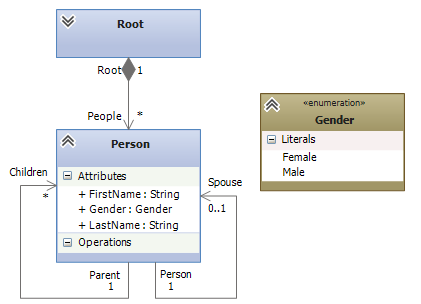
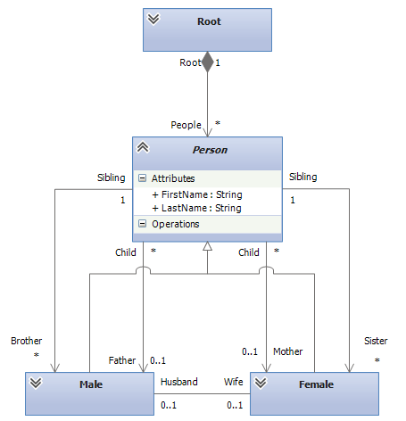

# Transforming Persons to FamilyRelations

This tutorial is about to transform models of a Persons metamodel into models of a FamilyRelations model. Both models contain basically the same information, but in different form. The goal of this tutorial is to introduce you with the main concept built into NTL to support inheritance hierarchies.

## The metamodels

The Persons metamodel is depicted above. It is a very simple metamodel. The gender of a person is modeled as an attribute and people have references to their spouses and children.

The FamilyRelations metamodel however models the very same situation differently. Here, the different genders are modeled explicitly through inheritance. Unlike a reference to children, a FamilyRelations Person model element has references to its father and mother, as well as to its brothers and sisters.

## Transformation

Suppose one of the metamodels is the metamodel in your application, but you get the data from elsewhere in a different format. Thus, you need to transform the models. 

## Setting up a new project

Create a new project, **[download the metamodels](Persons to FamilyRelations_metamodels.zip)** and add them to the project, add references to **NMF.Transformations.Core.dll** and **NMF.Transformations.dll** and create a new file _Persons2FamilyRelations.cs_ for the transformation from the Person metamodel to the FamilyRelations metamodel. Add the using statements

{code:c#}
using NMF.Transformations;
using NMF.Transformations.Core;
{code:c#}

## Tranforming the roots

Since the roots do not contain any information, just add a new empty rule.

{code:c#}
public class Root2Root : TransformationRule<Ps.Root, Fam.Root> { }
{code:c#}

We will need this rule first and foremost for reference.

## Transforming Person elements

Create a new rule _Person2Person_ with the following specification:

{code:c#}
public class Person2Person : AbstractTransformationRule<Ps.Person, Fam.Person>
{
      public override void RegisterDependencies()
      {
          CallForEach<Ps.Root, Fam.Root>(
              root => root.Persons,
              (root, people) => root.People.AddRange(people));
      }
}
{code:c#}

This transforms Person model elements of the _Persons_ metamodel to Person model elements of the _FamilyRelations_ metamodel. However, the latter is marked as abstract. Currently, NTL has no way to find out which classes to use and thus, the runtime would throw an exception if we did not add further rules to specify which concrete classes to use in this case.

These further rules then specify additional semantics what metaclass will be instantiated to create the output of the _Person2Person_ rule. Thus, the concept that we use here is called **Transformation Rule Instantiation**, as the instantiating rule instantiates the output of, in this case _Person2Person_. Instantiating rules can also have predicates and are allowed to have a slightly different signature (more specific input and and output types). 

However, transforming Person model elements also has a common behavior. At very least, we need to copy the first names and last names. Thus, add a _Transform_ method similar to the following to _Person2Person_:

{code:c#}
public override void Transform(Ps.Person input, Fam.Person output, ITransformationContext context)
{
    output.LastName = input.Name;
    output.FirstName = input.FirstName;
}
{code:c#}

## Transforming males and females

Thus, add the two following transformation rules.

{code:c#}
        public class Person2Female : TransformationRule<Ps.Person, Fam.Female>
        {
            public override void Transform(Ps.Person input, Fam.Female output, ITransformationContext context)
            {
                output.Husband = context.Trace.ResolveIn(Rule<Person2Male>(), input.Spouse);

                foreach (var child in context.Trace.ResolveManyIn(Rule<Person2Person>(), input.Children))
                {
                    child.Mother = output;
                }
            }

            public override void RegisterDependencies()
            {
                MarkInstantiatingFor(Rule<Person2Person>(), p => p.Gender == Ps.Gender.Female);
            }
        }

        public class Person2Male : TransformationRule<Ps.Person, Fam.Male>
        {
            public override void Transform(Ps.Person input, Fam.Male output, ITransformationContext context)
            {
                output.Wife = context.Trace.ResolveIn(Rule<Person2Female>(), input.Spouse);

                foreach (var child in context.Trace.ResolveManyIn(Rule<Person2Person>(), input.Children))
                {
                    child.Father = output;
                }
            }

            public override void RegisterDependencies()
            {
                MarkInstantiatingFor(Rule<Person2Person>(), p => p.Gender == Ps.Gender.Male);
            }
        }
{code:c#}

These two rules specify how Person model elements should be transformed. In case the _Gender_ attribute is set to Female, the _Person2Female_ rule is called and creates a new _Female_ model element. This element is then also used as the output of _Person2Person_, so if the Person model element is resolved for the _Person2Person_ rule somewhere in the code, it will find the _Female_ model element created by _Person2Female_. 

The code in _Person2Male_ and _Person2Female_ also already sets the Mother and Father references, as well as Wife and Husband.

## Sisters and Brothers

It is not trivial to obtain the brothers and sisters of a person, especially if solitaries with children are considered that can either be male or female. To solve this, we use the model representation of brothers and sisters as sets, where the collection implementation makes sure that it does not contain duplicate entries. Thus, it is a good idea to put the code also in _Person2Person_. Add the following code to the _Transform_ method:

{code:c#}
var daughters = context.Trace.ResolveManyIn(Rule<Person2Female>(), input.Children.Where(child => child.Gender == Ps.Gender.Female));
var sons = context.Trace.ResolveManyIn(Rule<Person2Male>(), input.Children.Where(child => child.Gender == Ps.Gender.Male));

output.Daughters.AddRange(daughters);
output.Sons.AddRange(sons);

foreach (var daughter in daughters)
{
      daughter.Sisters.AddRange(daughters.Except(daughter));
      daughter.Brothers.AddRange(sons);
 }

foreach (var son in sons)
{
       son.Sisters.AddRange(daughters);
       son.Brothers.AddRange(sons.Except(son));
}
{code:c#}

You might have to add a using statement to _NMF.Utilities_ for this to work. What we do is that we trace the transformed children and work with these objects. We can do so with arbitrary code. Here, we make a lot use of LINQ.